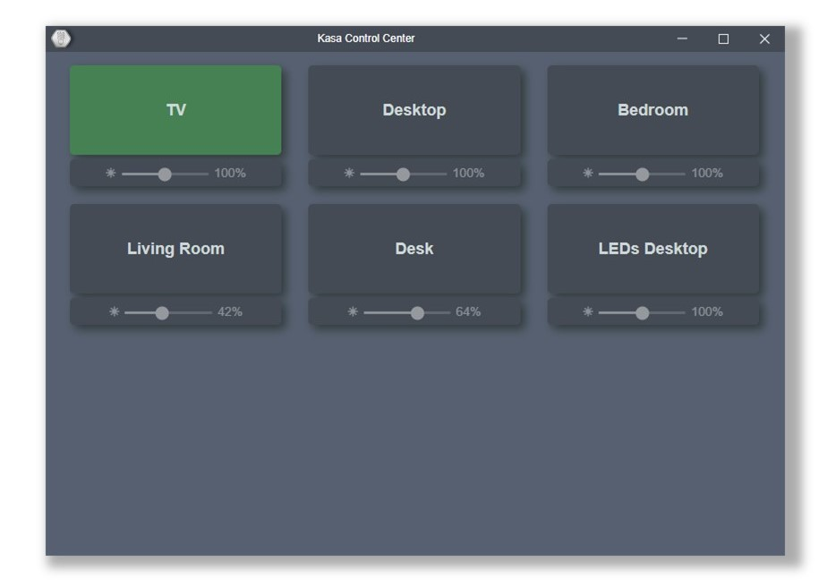

# Kasa Control Center

A desktop GUI to control TP-Link (Kasa) smart home devices. 

## Third-Party Libraries
* [plasticrake/tplink-smarthome-api](https://github.com/plasticrake/tplink-smarthome-api)
